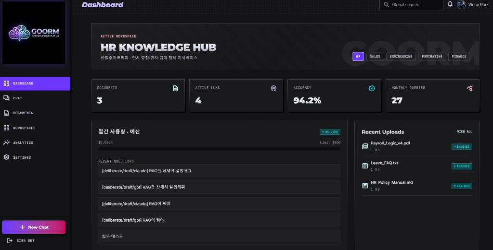

# Goorm KnowledgeHub AI

조직·부서 업무 문서를 RAG로 연결하고, GPT / Claude / Gemini / Perplexity를 통합한 **멀티 LLM 지식비서**입니다.

> 우리 조직의 문서를 가장 잘 이해하는 AI 업무 비서



기술명세: [`doc/SPEC Goorm KnowledgeHub AI.md`](doc/SPEC%20Goorm%20KnowledgeHub%20AI.md) (Version **1.2**)

---

## 주요 기능 (현재)

| 기능 | 설명 |
| --- | --- |
| **Neon RAG** | pgvector 검색 → 관련 문서 근거로 답변, Sources 표시 |
| **RAG 하이브리드** | 유사도 게이트로 `docs` / `hybrid` / `web` 분기 (무관 질문의 “문서에 없다” 거절 완화) |
| **수동 LLM** | GPT / Claude / Gemini / Perplexity 단일 호출 + Fallback |
| **AUTO Deliberate** | 멀티 LLM 병렬 초안 → Chair 합의 → 최종 답변, 협의 과정 UI |
| **답변 웹뷰** | 마크다운을 HTML 웹뷰로 렌더 (원문 전환 가능) |
| **채팅 기록 유지** | 워크스페이스별 `localStorage` 영속화 (탭 이동·새로고침 유지) |
| **사용량** | Neon `usage_logs` → Dashboard / Analytics |
| **UI** | Metallic Pop Art 디자인, Stitch 브랜드 로고 |

---

## 스택

- **Web:** React 19, Vite, TypeScript, Tailwind CSS v4, React Router, TanStack Query
- **API:** Express (`server/`), `tsx watch`
- **DB:** Neon PostgreSQL + pgvector
- **LLM:** OpenAI / Anthropic / Google / Perplexity (서버 `.env`만 사용)

---

## 빠른 시작

```bash
npm install
cp .env.example .env   # 키·DATABASE_URL 입력
npm run seed:rag       # Neon에 HR 샘플 문서 임베딩 (선택)
npm run dev
```

| 서비스 | URL |
| --- | --- |
| Web | http://localhost:5173 |
| API | http://localhost:8787 |

로그인: **Continue with Google** (현재 mock auth)

---

## 환경 변수

`.env` (서버 전용 키는 Vite에 노출되지 않음)

| 변수 | 용도 |
| --- | --- |
| `OPENAI_API_KEY` | GPT + 임베딩 |
| `ANTHROPIC_API_KEY` | Claude |
| `GOOGLE_API_KEY` | Gemini |
| `PERPLEXITY_API_KEY` | 웹 검색 (없으면 web 보강 제한) |
| `DATABASE_URL` | Neon 연결 문자열 |
| `API_PORT` | API 포트 (기본 `8787`) |
| `VITE_FIREBASE_*` | Firebase (미설정 시 mock 로그인) |

상세 템플릿: [`.env.example`](.env.example)

---

## Auto 협의 흐름

```text
질문
  → Neon RAG 검색
  → score 게이트 (docs | hybrid | web)
  → Round 1: 가용 모델 병렬 초안 (최대 3)
  → Round 2: Chair 합의 (일치 / 불일치 / 최종답변)
  → Chat: 협의 패널 + 웹뷰 최종 답변
```

수동 모델 선택 시에는 협의 없이 단일 호출 + Fallback(`gpt → claude → gemini → perplexity`)만 수행합니다.

---

## RAG 게이트

| top score | mode | 동작 |
| --- | --- | --- |
| ≥ ~0.38 | `docs` | 관련 청크만 주입, 문서 우선 |
| < 임계값 | `hybrid` | 컨텍스트 미주입, 일반 지식 허용 |
| Perplexity 선택 | `web` | 웹 검색 우선 |

---

## 채팅 기록

- 저장 위치: 브라우저 `localStorage`
- 키: `kh_chat_history:{workspaceId}`
- 상한: 최근 80메시지
- 다른 페이지 이동·새로고침 후에도 `/chat`에서 복원

기기 간 동기화가 필요하면 이후 Neon `chat_history` API로 확장하면 됩니다.

---

## 스크립트

| 명령 | 설명 |
| --- | --- |
| `npm run dev` | API + Vite 동시 실행 |
| `npm run seed:rag` | 샘플 문서 임베딩 |
| `npm run build` | 프로덕션 빌드 |
| `npm run preview` | 빌드 미리보기 |

---

## 화면

| Route | 페이지 |
| --- | --- |
| `/login` | 로그인 (mock Google) |
| `/` | Dashboard |
| `/workspaces` | Workspaces |
| `/workspaces/:id` | Knowledge Base |
| `/documents` | Documents (업로드·인덱싱) |
| `/chat` | Multi-LLM Chat |
| `/analytics` | Analytics / System Pulse |
| `/settings` | Fallback·설정 UI |

디자인 참고: `UI/` · 로고: `public/brand/goorm-knowledgehub-logo.png`

---

## 디렉터리 (요약)

```text
src/           React 앱 (pages, components, services)
server/        Express API
  llm/         providers, router, orchestrator, deliberate, fallback
  rag/         chunk, embed, search, seed, index
  usage/       usage_logs, analytics
doc/           기술명세 SPEC
```

---

## 미구현 / 로드맵

- Firebase 실로그인
- 가드레일·의미 캐시
- PDF 바이너리 파싱 고도화
- 채팅 서버 동기화
- MCP·메신저·ERP 연동 (SPEC Phase 3)

---

## 라이선스

Private / 내부 프로젝트.
